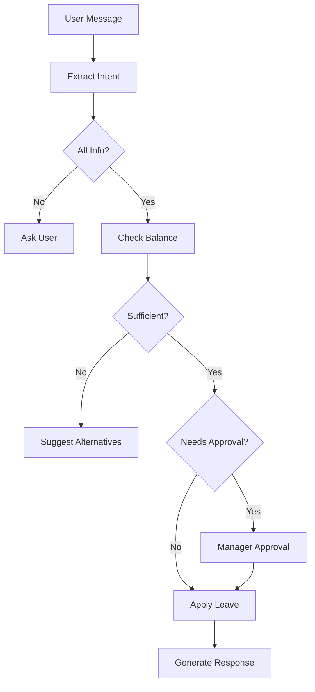

# 🚀 LangGraph Migration Guide

Complete guide for implementing state-machine based HRMS workflows using LangGraph.

---

## 📋 Table of Contents

1. [Why LangGraph?](#why-langgraph)
2. [What Was Built](#what-was-built)
3. [Architecture Overview](#architecture-overview)
4. [Installation](#installation)
5. [Usage Examples](#usage-examples)
6. [Integration with Existing Code](#integration)
7. [Testing](#testing)
8. [Advanced Features](#advanced-features)
9. [Migration from LangChain](#migration-from-langchain)

---

## 🎯 Why LangGraph?

### **Current Approach (LangChain)**
```
User message → Extract intent → Check complete? → Execute OR Ask
```

**Limitations:**
- ❌ No complex workflow support
- ❌ Manual state management
- ❌ No approval chains
- ❌ Hard to add conditional logic
- ❌ No parallel task execution

### **With LangGraph (State Machine)**
```
User message → [Workflow Graph] → Multiple conditional paths → Execute with approvals
```

**Benefits:**
- ✅ Complex multi-step workflows
- ✅ Automatic state persistence (checkpoints)
- ✅ Approval chains (human-in-the-loop)
- ✅ Conditional branching
- ✅ Parallel task execution
- ✅ Visual workflow debugging
- ✅ Easy to modify/extend

---

## 📦 What Was Built

### **New Files Created:**

```
services/ai/
├── langgraph_config.py              # ✅ LangGraph setup & state definitions
├── hrms_workflow_orchestrator.py    # ✅ Main workflow manager
└── workflows/
    ├── __init__.py
    ├── intent_extraction.py         # ✅ Intent extraction node
    ├── validation.py                # ✅ Data validation node
    ├── execution.py                 # ✅ Action execution node
    ├── response.py                  # ✅ Response generation node
    └── leave_approval_workflow.py   # ✅ Advanced leave workflow

test_langgraph_workflows.py          # ✅ Comprehensive test suite
LANGGRAPH_MIGRATION.md               # ✅ This guide
```

---

## 🏗️ Architecture Overview

### **State-Based Workflow**



### **Key Components**

#### **1. State Definitions** (langgraph_config.py)

```python
class HRMSState(TypedDict):
    """Base state for all workflows."""
    user_id: str
    session_id: str
    messages: Sequence[BaseMessage]
    intent: str
    extracted_data: Dict
    current_step: str
    response: str
    ready_to_execute: bool
```

#### **2. Workflow Nodes** (workflows/*)

Each node performs ONE specific task:
- `extract_intent_node`: Extract user intent
- `validate_data_node`: Validate extracted data
- `execute_action_node`: Execute HRMS action
- `generate_response_node`: Create user response

#### **3. Workflow Orchestrator** (hrms_workflow_orchestrator.py)

Manages all workflows and provides simple API:

```python
from services.ai.hrms_workflow_orchestrator import process_hrms_message

result = await process_hrms_message(
    user_id="240611",
    user_message="apply sick leave",
    session_id="sess123"
)
```

---

## 🚀 Installation

### **Step 1: Dependencies Already Installed**

```bash
# LangGraph packages already in requirements.txt:
# - langgraph
# - langgraph-checkpoint
```

### **Step 2: (Optional) Enable Redis Checkpointing**

For production state persistence:

```bash
# Add to .env
USE_REDIS_CHECKPOINT=true
```

---

## 💡 Usage Examples

### **Example 1: Simple Usage (from app.py)**

```python
from services.ai.hrms_workflow_orchestrator import process_hrms_message

@app.post("/chat")
async def chat(request: ChatRequest):
    result = await process_hrms_message(
        user_id=request.userId,
        user_message=request.message,
        session_id=request.sessionId
    )

    return {
        "response": result["response"],
        "sessionId": result["sessionId"]
    }
```

### **Example 2: Multi-turn Conversation**

```python
from services.ai.hrms_workflow_orchestrator import get_orchestrator

orchestrator = get_orchestrator()

# Message 1
result1 = await orchestrator.process_message(
    user_id="240611",
    user_message="apply leave",
    session_id="sess123"
)
# Response: "What type of leave?"

# Message 2 (continues from checkpoint)
result2 = await orchestrator.process_message(
    user_id="240611",
    user_message="sick",
    session_id="sess123"  # Same session!
)
# Response: "For which date?"

# Message 3
result3 = await orchestrator.process_message(
    user_id="240611",
    user_message="tomorrow, not feeling well",
    session_id="sess123"
)
# Response: "Leave applied successfully!"
```

### **Example 3: Stream Workflow Steps**

```python
from services.ai.workflows.leave_approval_workflow import build_leave_approval_workflow

workflow = build_leave_approval_workflow()

# Stream each step
for step in workflow.stream(initial_state, config):
    print(f"Current node: {step}")
    print(f"State: {step.get('current_step')}")
```

### **Example 4: Visualize Workflow**

```python
from services.ai.hrms_workflow_orchestrator import get_orchestrator

orchestrator = get_orchestrator()

# Create workflow visualization
orchestrator.visualize_workflow("leave_approval", "workflow.png")
# Creates workflow.png with graph visualization
```

---

## 🔗 Integration with Existing Code

### **Option 1: Replace Existing Handler (Recommended)**

Update `app.py` to use LangGraph:

```python
# OLD (app.py):
from services.operations.ai_handler import handle_hrms_with_ai

result = await handle_hrms_with_ai(user_id, user_message, session_id)

# NEW (app.py):
from services.ai.hrms_workflow_orchestrator import process_hrms_message

result = await process_hrms_message(user_id, user_message, session_id)
```

### **Option 2: Gradual Migration**

Use LangGraph for specific intents only:

```python
from services.ai.hrms_workflow_orchestrator import process_hrms_message
from services.operations.ai_handler import handle_hrms_with_ai

# Use LangGraph for complex workflows
if intent in ["apply_leave", "apply_regularization"]:
    result = await process_hrms_message(user_id, message, session_id)
else:
    # Use old handler for simple operations
    result = await handle_hrms_with_ai(user_id, message, session_id)
```

---

## ✅ Testing

### **Run Test Suite**

```bash
# Run all tests
python test_langgraph_workflows.py
```

**Tests included:**
1. ✅ Simple leave application
2. ✅ Multi-turn conversation
3. ✅ Leave balance query
4. ✅ Attendance regularization
5. ✅ On-duty application
6. ✅ Workflow visualization
7. ✅ State persistence

### **Manual Testing**

```bash
# Start server
uvicorn app:app --reload --port 8000

# Test API
curl -X POST http://localhost:8000/chat \
  -H "Content-Type: application/json" \
  -d '{
    "userId": "240611",
    "message": "apply sick leave for tomorrow",
    "sessionId": "test123"
  }'
```

---

## 🎨 Advanced Features

### **1. Custom Workflows**

Create your own workflow:

```python
from langgraph.graph import StateGraph, END
from services.ai.langgraph_config import HRMSState

def build_custom_workflow():
    graph = StateGraph(HRMSState)

    # Add your nodes
    graph.add_node("step1", my_step1_function)
    graph.add_node("step2", my_step2_function)

    # Add edges
    graph.add_edge("step1", "step2")
    graph.add_edge("step2", END)

    # Compile
    return graph.compile()
```

### **2. Human-in-the-Loop Approvals**

```python
def manager_approval_node(state):
    """Wait for manager approval."""
    # In production:
    # 1. Send notification to manager
    # 2. Pause workflow (checkpoint)
    # 3. Resume when manager responds

    if state.get("manager_approved"):
        return state
    else:
        # Wait for approval
        state["approval_status"] = "pending"
        return state
```

### **3. Parallel Task Execution**

```python
from langgraph.graph import StateGraph

graph = StateGraph(HRMSState)

# Run these in parallel
graph.add_node("notify_manager", notify_manager_func)
graph.add_node("update_calendar", update_calendar_func)
graph.add_node("send_email", send_email_func)

# All start from same source
graph.add_edge("start", "notify_manager")
graph.add_edge("start", "update_calendar")
graph.add_edge("start", "send_email")

# Converge at end
graph.add_edge(["notify_manager", "update_calendar", "send_email"], END)
```

### **4. Conditional Routing**

```python
def route_by_duration(state):
    """Route based on leave duration."""
    duration = state["extracted_data"].get("duration", 0)

    if duration > 5:
        return "manager_approval"
    elif duration > 3:
        return "hr_approval"
    else:
        return "auto_approve"

graph.add_conditional_edges(
    "check_duration",
    route_by_duration,
    {
        "manager_approval": "manager_node",
        "hr_approval": "hr_node",
        "auto_approve": "apply_node"
    }
)
```

---

## 🔄 Migration from LangChain

### **What Changed**

| Feature | LangChain | LangGraph |
|---------|-----------|-----------|
| **Workflow** | Linear | Graph-based |
| **State** | Manual Redis | Automatic checkpoints |
| **Approval** | Hard to implement | Built-in |
| **Branching** | if/else | Conditional edges |
| **Debugging** | Logs only | Visual graph + LangSmith |
| **Resume** | Manual | Automatic |

### **Code Comparison**

**Before (LangChain):**
```python
# Manual flow management
result = extract_intent(message)
if not result["ready"]:
    return ask_question()

if needs_approval():
    return send_for_approval()

return execute_action()
```

**After (LangGraph):**
```python
# Workflow handles everything
result = await process_hrms_message(user_id, message, session_id)
return result["response"]
```

---

## 📊 Performance & Scaling

### **State Persistence**

- ✅ **Development**: In-memory (MemorySaver)
- ✅ **Production**: Redis checkpointing (optional)

### **Concurrent Workflows**

Each `user_id:session_id` pair has independent state:

```python
# User A, Session 1
process_hrms_message("user_a", "apply leave", "sess_1")

# User B, Session 1 (different user, independent state)
process_hrms_message("user_b", "apply leave", "sess_1")

# User A, Session 2 (same user, different session)
process_hrms_message("user_a", "check balance", "sess_2")
```

---

## 🐛 Troubleshooting

### **Issue 1: Workflow not resuming**

**Solution**: Ensure same `session_id` across messages:

```python
# ❌ Wrong
result1 = await process_hrms_message(user_id, msg1, "sess1")
result2 = await process_hrms_message(user_id, msg2, "sess2")  # Different!

# ✅ Correct
session_id = "persistent_session"
result1 = await process_hrms_message(user_id, msg1, session_id)
result2 = await process_hrms_message(user_id, msg2, session_id)  # Same!
```

### **Issue 2: Visualization not working**

**Solution**: Install graphviz:

```bash
# Mac
brew install graphviz
pip install pygraphviz

# Ubuntu
sudo apt-get install graphviz graphviz-dev
pip install pygraphviz
```

### **Issue 3: Import errors**

**Solution**: Ensure all new files are in correct locations:

```bash
ls services/ai/workflows/
# Should show: __init__.py, intent_extraction.py, etc.
```

---

## ✅ Migration Checklist

- [ ] LangGraph dependencies installed
- [ ] All workflow files created
- [ ] Test suite runs successfully (`python test_langgraph_workflows.py`)
- [ ] Visualizations generated (optional)
- [ ] Redis checkpointing configured (production only)
- [ ] app.py updated to use new orchestrator
- [ ] API endpoints tested
- [ ] Multi-turn conversations tested
- [ ] State persistence verified

---

## 🎉 Success Criteria

You've successfully migrated to LangGraph when:

1. ✅ Test suite passes all tests
2. ✅ Multi-turn conversations work (state persists)
3. ✅ Complex workflows execute (leave approval with balance check)
4. ✅ Conditional routing works (approval vs auto-approve)
5. ✅ Workflow visualizations generated

---

## 📞 Next Steps

**After Migration:**

1. **Add More Workflows**
   - Onboarding process
   - Offboarding process
   - Transfer requests
   - Salary processing

2. **Enable Advanced Features**
   - Manager approval integration
   - Email notifications in workflow
   - Calendar updates
   - Multi-department coordination

3. **Monitoring & Debugging**
   - Enable LangSmith tracing
   - Create custom metrics
   - Monitor workflow performance

---

## 📚 Resources

- **LangGraph Docs**: https://langchain-ai.github.io/langgraph/
- **LangSmith**: https://smith.langchain.com/
- **Code Examples**: `test_langgraph_workflows.py`
- **Workflow Definitions**: `services/ai/workflows/`

---

**🎊 Congratulations!** You now have a production-ready, state-machine based HRMS workflow system powered by LangGraph!

*Migration completed by Zimyo AI Team*
